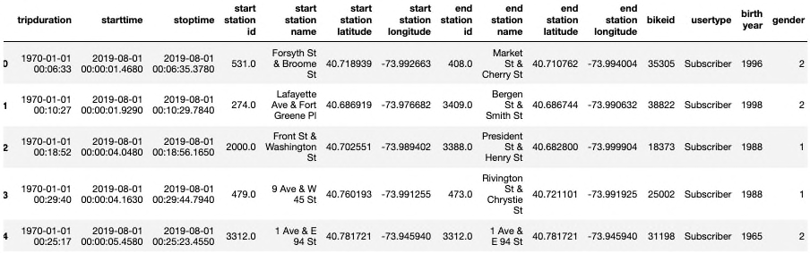
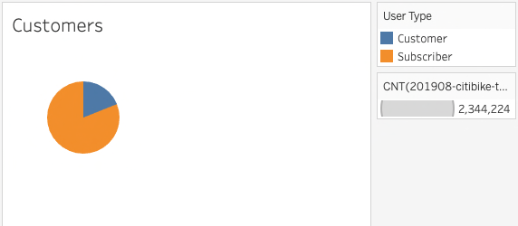
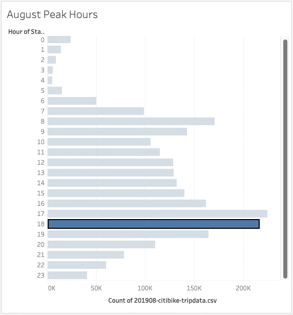
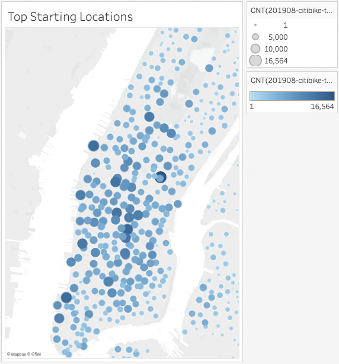
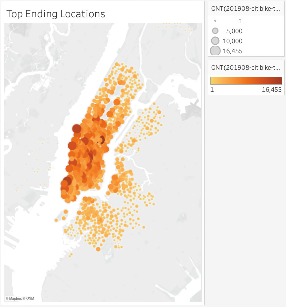
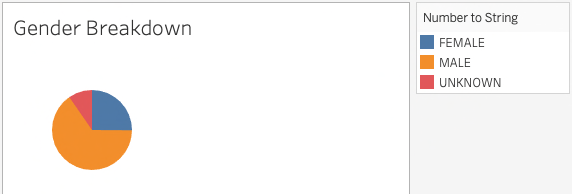
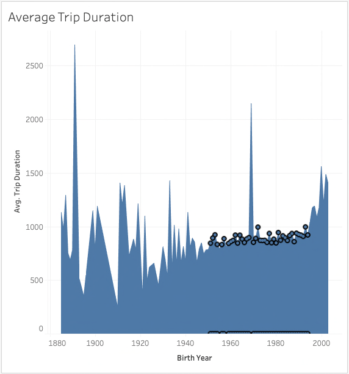
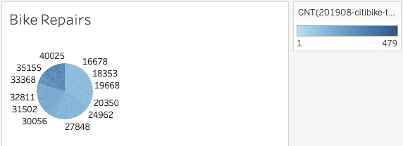
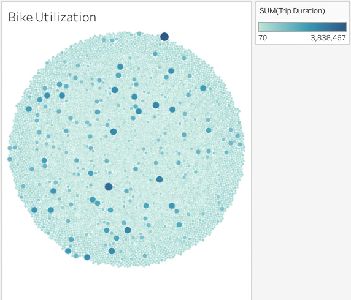
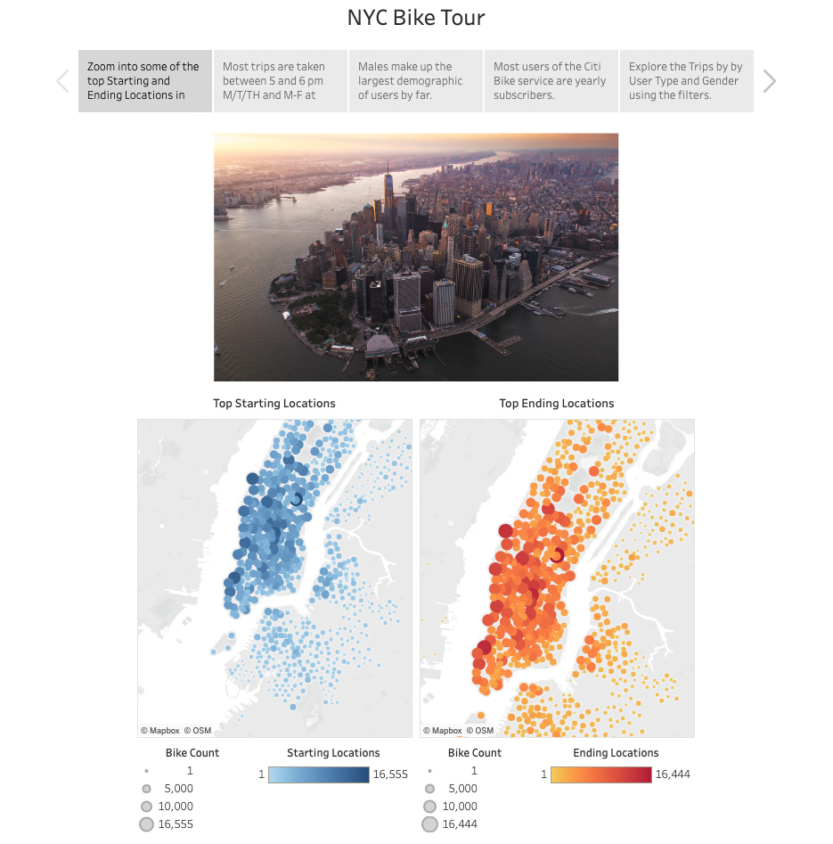

# Bike Sharing Analysis for Des Moines, Iowa

After spending time in NYC using the CitiBike service to get around and see the sites, we decided that this may be a great idea for the city of Des Moines as well. This analysis will show that a bike sharing business is a feasible idea for Des Moines just like it is for NYC.

Obviously, Des Moines is a much different city that NYC but we will attempt to show that this is a great idea for our city as well by comparing data from both cities.

## Analysis Process

To start, we will be using Tableau to examine the data that is available through Citibike for NYC. This is in the form of a CSV file so the first step in this process is to download the CSV file and clean it up for Tableau to create the charts we need to get a good picture of the data.

### Cleaning the Data

For our analysis we used the trip data from August 2019. Before bringing this data into Tableau, we uploaded it into dataframe in Jupyter Notebook. The following image shows the data as it was imported directly from the citibike CSV file:

Once the data was cleaned the new CSV file was updated into Tableau to create various charts to get a better sense of how we can start up a new business venture renting bikes to tourists and others living and working in Des Moines, IA.

The Tableau file can be viewed by opening the file 'TODO: Tableau file name' in Tableau.

### Determine Customer vs. Subscriber

The next tab labeled 'Customer' shows a pie chart of the 2 types of customers, those that short term users and those that are subscribers to the bike sharing service:

Note that most of the users are subscribers. This will help us determine different subscription options and prices for Des Moines.

### August Peak Hours

To determine the peak hours in August of 2019, we used the following bar chart:

From this chart we can see that the top riding hours during August in NYC are between 5pm and 7pm.

Alternatively, the lowest number of rides occurred between the hours of 2am and 5am. Since this is one of the least active riding times, fewer bikes will be needed which makes it a good time to perform maintenance.

### Top Starting Locations

### Top Ending Locations

### Gender Breakdown

### Average Trip Duration

How is birth year related to the length of a bike ride? Let us look at the following chart to find out:

In general, the later the birth year, the longer the ride duration.

Also note, that for birth years between 1950 to approximately 1995, the trip duration is consistently in the range of 800 - 1000.

### Bike Repairs

What can the data tell us about the upkeep bikes might need? The following chart shows the number of rides taken on each bike.

We also looked at how long each ride was and which bikes may need more attention than others:

## Dashboards and Stories

Several dashboards were created to help make several points in our story.

To see the full story complete with dashboards check out this link:
[NYC Bike Tour Story] (#https://public.tableau.com/app/profile/stefc5581/viz/BikeSharingAnalysis_16678076895740/CitiBikeOverview?publish=yes)

## Summary

Overall, almost all of the rides were under 1 hour regardless of gender.

Also, most rides that were taken in August of 2019 were by males.

Before starting in Des Moines we want to find out the answers to the following questions:

- What are the demographics such as age and gender?
- How many visitors in Des Moines currently use mass transit or walk from one point to another?
- How many residents in currently walk, ride a bike or use mass transit to go to work or shop?
- Which locations in Des Moines are similar to the most popular starting and ending locations in NYC?
- How many of these locations are available to set up a rental station?
