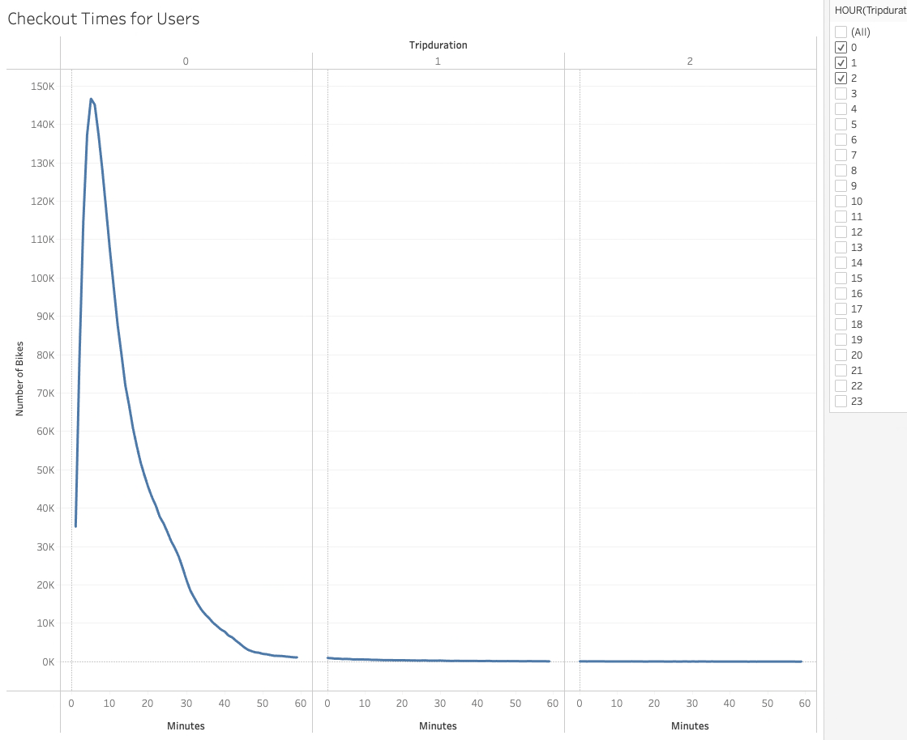
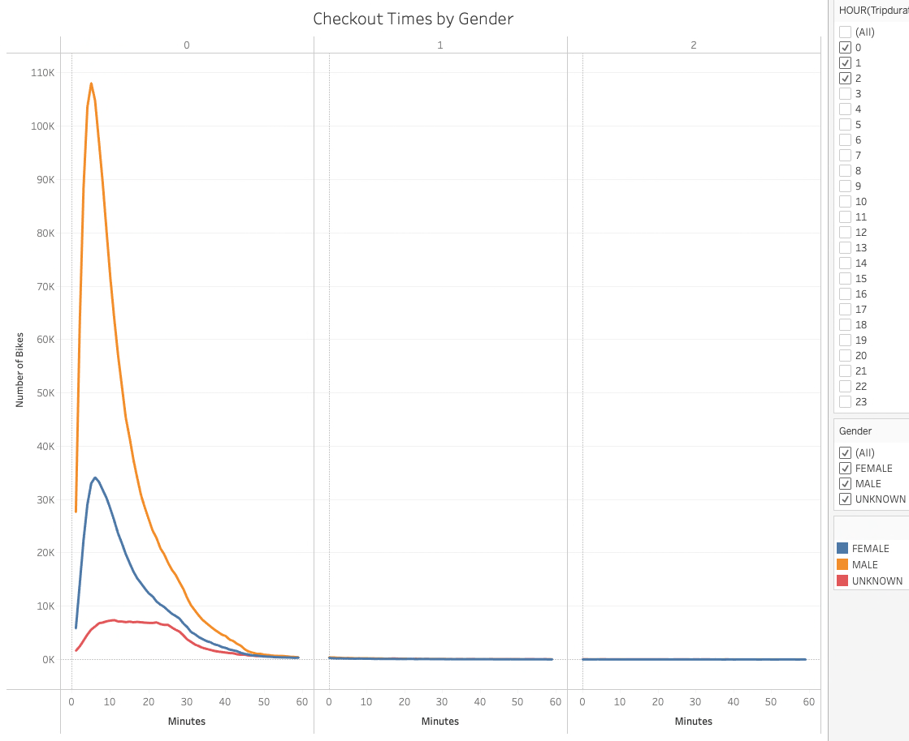

# Bike Sharing Analysis for Des Moines, Iowa

After spending time in NYC using the CitiBike service to get around and see the sites, we decided that this may be a great idea for the city of Des Moines as well. This analysis will show that a bike sharing business is a feasible idea for Des Moine just like it is for NYC.

Obviously, Des Moines is a much different city that NYC but we will attempt to show that this is a great idea for our city as well by comparing data from both cities.

## Analysis Process

To start, we will be using Tableau to examine the data that is available through Citibike for NYC. This is in the form of a CSV file so the first step in this process is to download the CSV file and clean it up for Tableau to create the charts we need to get a good picture of the data.

### Cleaning the Data

For our analysis we used the trip data from August 2019. Before bringing this data into Tableau, we uploaded it into dataframe in Jupyter Notebook. The following image shows the data after the trip duration time was converted from seconds to a datetime datatype:

Once the data was cleaned the new CSV file was updated into Tableau to create various charts to get a better sense of how we can start up a new business venture renting bikes to tourists and others living and working in Des Moines, IA.

The Tableau file can be viewed by opening the file 'TODO: Tableau file name' in Tableau.

### Checkout Times for Users

The first tab named 'Checkout Times for Users' shows the total time of every ride taken in August of 2019:

### Checkout Times by Gender

The next tab labeled 'Checkout Times by Genders' shows the total duration of every ride by gender:

## Dashboard

To access the Dashboard for our Bike Sharing Analysis check out the following link:
[Bike Sharing Analysis](https://public.tableau.com/app/profile/stefc5581/viz/BikeSharingAnalysis_16678076895740/Dashboard1?publish=yes)

## Summary

Overall, almost all of the rides were under 1 hour regardless of gender.

Also, most rides that were taken in August of 2019 were by males.
